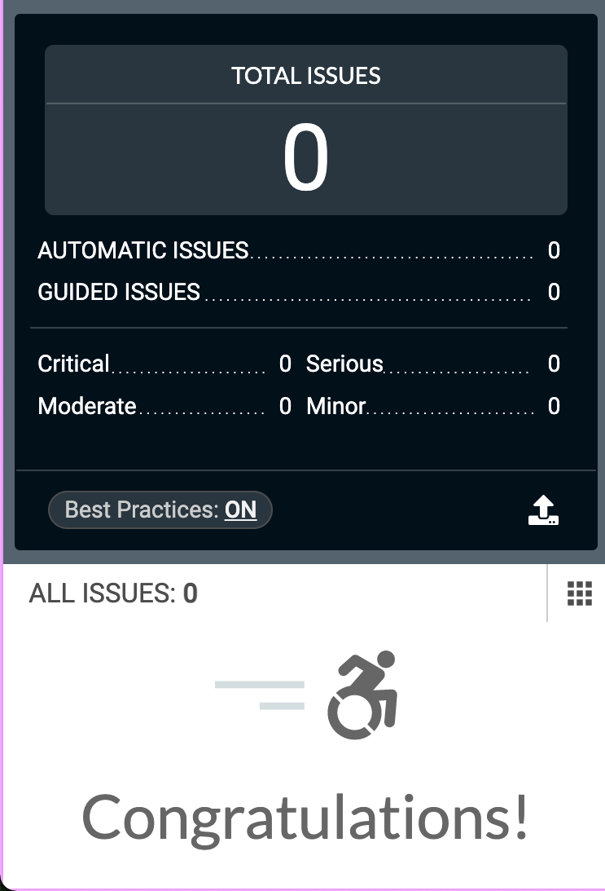

# Engrain Assessment - Derek Mason

## Overview

Using PHP to connect to the referenced API endpoint using the provided credentials, records are iterated through to return data and create two separate lists.

Any unit with an area value of 1, will be in one list and any area value greater than 1 in a separate list.

The lists display the unit number, the area, and last updated date for each unit.

Click on any list item to open more info about that unit.

---

<br>

## Getting Started

From `root` directory after installing dependencies (`npm i`)

Run

```
  npm start
```

- Build web assets and begin development at `localhost:3000`

and in a separate terminal

```
  php -S localhost:8000
```

- Start PHP server to handle requests

---

<br>

### Passing all axeDevTools requirements



---

## Contributors

Derek Mason is a developer in Denver, Colorado who uses software engineering as a tool to bring impactful ideas to life. Find out more at [derekmason.dev](https://derekmason.dev)

---
